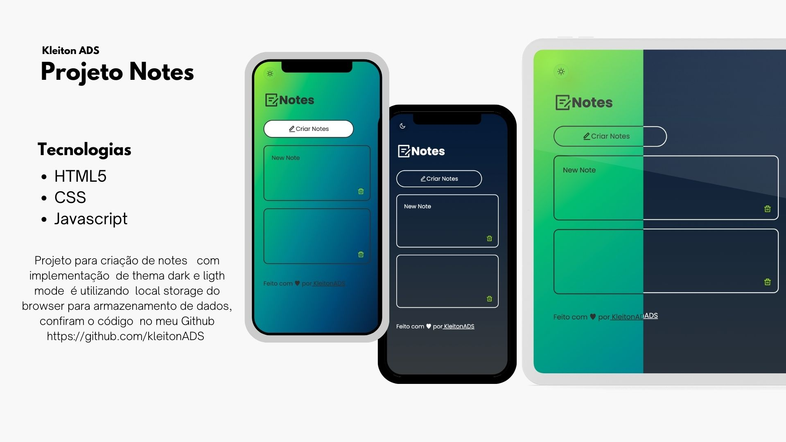

<h1 align="center"> Projeto - Notes APP  </h1>

  

 Notes App é um projeto para criação de de notes no próprio browser podendo nele cadatrar um novo note, deletar, atualizar é manter os dados dos seus notes mesmo atualizando a página últilizando o local storage do próprio browser pra armazenamento dos dados assim como os dados do thema que esta últilizando.  

  

 

## 🚀 Tecnologias

Esse projeto foi desenvolvido com as seguintes tecnologias:

- HTML e CSS
- JavaScript
- Git e Github

## 🚀Aprendizado

Nesse projeto pude últilizar todo o meus conhecimentos de HTML,CSS e aprimorar ainda mais meus conhecimentos de JavaScript pude manipular e criar alguns elementos da página últilizando apenas o js assim com o aprendizado de poder guarda os dados criados, no local Storage do browser  abrindo novas possibilidades para novos projetos

## 💻  Link do Projeto

- [Acesse o projeto](https://kleitonads.github.io/notesApp/)

---

Feito com ♥ Kleiton ADS
